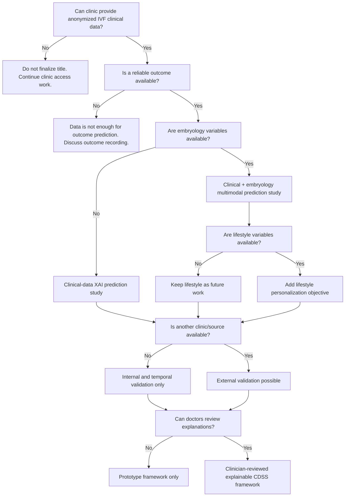

# Panel Question Bank Stage 3

Stage 3 converts dataset uncertainty into a clear feasibility framework.

The purpose is to answer panel questions like:

- What if you do not get all data?
- What is the minimum feasible PhD?
- What changes if embryo or lifestyle data is missing?
- Can this be done with one clinic?
- What claims will you avoid?

## Stage 3 Rule

Do not force the original title if the dataset does not support it.

The final title must follow the data.

## Feasibility Levels

| Level | Data Available | Feasibility | Safe Position |
| --- | --- | --- | --- |
| Level 0 | No IVF clinical data | Not feasible yet | Continue literature review and clinic negotiation. |
| Level 1 | Basic clinical data + outcome | Feasible | Clinical-data-based explainable IVF outcome prediction. |
| Level 2 | Clinical + embryology data | Strong | Multimodal clinical and embryological IVF prediction. |
| Level 3 | Clinical + embryology + lifestyle data | Very strong | Personalized multimodal IVF prediction with lifestyle context. |
| Level 4 | Level 2 or 3 + second clinic/source | Strongest | External validation/generalization in Indian IVF settings. |
| Level 5 | Level 4 + clinician explanation review | Best PhD shape | Explainable, validated and clinician-reviewed CDSS framework. |

## Main Dataset Decision Tree

## Scenario-Based Plan

| Scenario | Feasible Study Direction | What Can Be Claimed | What Cannot Be Claimed |
| --- | --- | --- | --- |
| No clinic data yet | Literature-backed proposal only | There is a justified research direction. | No final title, no final hypotheses, no model development. |
| Clinical data only | Explainable IVF outcome prediction using clinical data | Clinical predictors can be modeled and explained. | Multimodal clinical-embryology prediction. |
| Clinical + embryology data | Multimodal IVF outcome prediction | Clinical and embryology variables can be compared or combined. | Lifestyle personalization, unless lifestyle data exists. |
| Clinical + lifestyle data, no embryology | Personalized clinical/lifestyle IVF prediction | Lifestyle can be studied if collected reliably. | Embryology-based multimodal claims. |
| One clinic only | Single-center model with internal/temporal validation | Local feasibility and clinic-specific insights. | Generalization to all Indian IVF clinics. |
| Multiple clinics | External validation or multi-center analysis | Generalization can be tested more strongly. | National-level claims unless sample is nationally representative. |
| No live-birth outcome | Clinical pregnancy prediction | Pregnancy prediction can be studied. | Live-birth prediction. |
| No clinician review | Model + XAI prototype | Technical explainability can be shown. | Clinician usability or trust improvement. |
| Clinician review possible | XAI/CDSS usability evaluation | Doctor-facing usefulness can be evaluated. | Actual clinical outcome improvement unless prospectively tested. |

## Minimum Viable PhD Dataset

The minimum viable dataset should include:

| Category | Variables |
| --- | --- |
| Outcome | Clinical pregnancy or live birth |
| Demographic | Female age, BMI |
| Infertility profile | Infertility duration, infertility type, infertility cause |
| Ovarian reserve | AMH and/or AFC |
| Treatment | IVF/ICSI, fresh/frozen transfer, stimulation protocol |
| Transfer | Endometrial thickness, number of embryos transferred |
| Validation fields | Treatment year or cycle date for temporal split |

Safe title direction:

**An Explainable Clinical Decision Support Framework for IVF Outcome Prediction Using Clinical Data**

## Strong Dataset

A strong dataset includes the minimum dataset plus:

| Category | Variables |
| --- | --- |
| Oocyte data | Oocytes retrieved, mature oocytes |
| Fertilization | Fertilization method, fertilization count/rate |
| Embryology | Embryo grade, blastocyst grade, transfer day |
| Treatment response | Total gonadotropin dose, stimulation duration, trigger-day hormones |

Safe title direction:

**An Explainable and Personalized Clinical Decision Support Framework for IVF Outcome Prediction Using Multimodal Clinical and Embryological Data**

## Best Dataset

The best dataset includes the strong dataset plus:

| Category | Variables |
| --- | --- |
| Lifestyle | Smoking, alcohol, sleep, stress, diet pattern, physical activity |
| Context | socioeconomic or occupational factors if ethically collected |
| Validation | second clinic or independent time period |
| Clinical review | doctor feedback on explanations |

Safe title direction:

**An Explainable Multimodal Clinical Decision Support Framework for Personalized IVF Outcome Prediction Using Clinical, Embryological and Lifestyle Data**

If a second clinic is available:

**with External Validation in Indian IVF Settings**

## Dataset-Dependent Research Questions

| Data Available | Research Question Type |
| --- | --- |
| Clinical data only | Which clinical factors predict IVF outcome, and can an explainable model support counseling? |
| Clinical + embryology | Does adding embryology variables improve prediction over clinical variables alone? |
| Clinical + lifestyle | Do lifestyle and contextual variables add predictive value beyond clinical factors? |
| Multi-clinic data | Does the model generalize across Indian IVF clinics? |
| Clinician review | Are model explanations understandable and useful to IVF clinicians? |

## Dataset-Dependent Hypotheses

These are not final hypotheses. They are conditional templates.

| Hypothesis | Required Data | Status |
| --- | --- | --- |
| A clinical + embryology model performs better than a clinical-only model. | Clinical variables, embryology variables and same outcome. | Conditional |
| A model with lifestyle variables improves calibration or discrimination compared with clinical-only data. | Reliable lifestyle variables plus clinical outcome. | Conditional |
| XAI explanations improve clinician understanding of model predictions. | Clinician review protocol and explanation samples. | Conditional |
| A model trained on one clinic maintains acceptable performance in another clinic. | Independent second clinic/source. | Conditional |
| Live-birth prediction is feasible using available IVF records. | Reliable live-birth follow-up. | Conditional |

## What To Say If Data Is Limited

Panel question:

> What will you do if you do not get all variables?

Safe answer:

> The title and objectives will be adjusted according to data availability. If only clinical data is available, I will not claim multimodal clinical-embryology prediction. If live birth is not available, I will use clinical pregnancy with a clear limitation. If only one clinic is available, I will not claim external validation. The aim is to keep the study feasible and scientifically honest.

Confidence: **Confident**

## What To Say If External Validation Is Not Possible

Safe answer:

> External validation is ideal, but it depends on access to an independent clinic or dataset. If it is not possible, I will use internal validation and temporal validation where possible, clearly label the study as single-center, and keep external validation as future work.

Confidence: **Conditional**

## What To Say If Lifestyle Data Is Not Available

Safe answer:

> I will not force lifestyle data into the thesis. If lifestyle data is unavailable, it will become future work or a separate questionnaire-based sub-study. The main model can still focus on clinical and embryology variables if those are available.

Confidence: **Conditional**

## What To Say If Doctors Do Not Allow Deployment

Safe answer:

> Full deployment is not required for the initial PhD. A feasible plan is to develop a prototype explainable decision-support framework and ask clinicians to review the explanations for understandability and usefulness. Clinical deployment and outcome impact can be future work.

Confidence: **Confident**

## Claims Allowed And Not Allowed

| Situation | Allowed Claim | Avoid Claim |
| --- | --- | --- |
| One clinic data | Model was developed and internally/temporally validated on one clinic dataset. | Model works for all Indian IVF clinics. |
| Clinical pregnancy outcome | Model predicts clinical pregnancy. | Model predicts live birth. |
| XAI method used | SHAP/LIME-style explanations were generated. | Doctors trust the model. |
| Clinician review completed | Clinicians found explanations understandable/useful. | The tool improves live-birth rates. |
| Lifestyle questionnaire collected | Lifestyle variables were analyzed. | Lifestyle causes IVF success or failure. |
| No external dataset | External validation is future work. | External validation was done. |

## Feasibility Checklist For Doctor Meeting

Use this before meeting doctors or clinics.

| Area | Question | Why It Matters |
| --- | --- | --- |
| Records | How many IVF/ICSI cycles are available from 2021-2025? | Determines sample size and feasibility. |
| Outcome | Is live birth recorded reliably? | Decides final dependent variable. |
| Pregnancy | Is clinical pregnancy recorded consistently? | Backup outcome if live birth missing. |
| Embryology | Are embryo grades and transfer details available digitally? | Decides whether "embryological data" can stay in title. |
| Ovarian reserve | Are AMH and AFC available? | Important baseline predictors. |
| Lifestyle | Is lifestyle data recorded? Can a questionnaire be used? | Decides lifestyle scope. |
| Validation | Is another clinic/source/year split possible? | Decides external/temporal validation. |
| Clinician review | Can doctors review sample model explanations? | Decides CDSS usability objective. |
| Ethics | What approvals are required? | Required before data use. |
| Data format | Is data in Excel, EMR, paper or mixed format? | Determines cleaning effort. |

## Stage 3 Completion Check

Stage 3 is complete when:

- every dataset limitation has a fallback plan
- title options are tied to available data
- unsupported claims are blocked
- minimum, strong and best dataset scenarios are clear
- doctor meeting questions are ready

## Next Stage

Stage 4 should create the variable and outcome map:

- dependent variables
- independent variables
- confounders
- moderators
- mediators
- mandatory variables
- optional variables
- variables that require ethics caution
