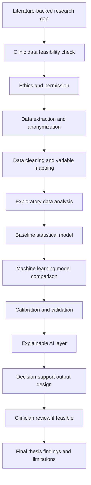

# Panel Question Bank Stage 6

Stage 6 gives a methodology blueprint for panel discussion.

This is not the final thesis methodology. It is a defensible workflow that can be adapted after clinic data access is confirmed.

## Stage 6 Rule

Methodology must follow the available dataset.

Do not promise:

- deep learning without image/video or large data
- external validation without independent data
- clinician usability without clinician review
- live-birth prediction without live-birth follow-up
- clinical deployment without ethics approval and clinic permission

## Methodology Overview

## Phase 1: Data Feasibility And Ethics

| Step | Work | Output | Condition |
| --- | --- | --- | --- |
| Clinic discussion | Confirm available data fields, years and record format | Data feasibility summary | Required |
| Ethics planning | Identify university/clinic ethics approval path | Ethics checklist | Required |
| Data permission | Confirm anonymized data sharing | Permission document/process | Required |
| Scope adjustment | Match title and objectives to available data | Finalized scope | Required |

Panel answer:

> The first methodology step is not model building. It is data feasibility and ethics confirmation. Without reliable outcome data and permission, the final title and hypotheses should not be fixed.

Confidence: **Confident**

## Phase 2: Data Extraction And Data Model

| Data Table | Purpose | Examples |
| --- | --- | --- |
| Patient table | Baseline patient profile | age, BMI, infertility duration, diagnosis |
| Cycle table | IVF treatment details | IVF/ICSI, protocol, fresh/FET, transfer details |
| Hormone table | ovarian reserve and stimulation markers | AMH, AFC, FSH, LH, estradiol, progesterone |
| Embryology table | lab and embryo development details | oocytes, mature oocytes, fertilization, embryo grade |
| Outcome table | target outcome | clinical pregnancy, live birth, miscarriage |
| Lifestyle table | optional personalization data | smoking, sleep, stress, physical activity |

Condition:

Use only tables that actually exist or can be reliably collected.

## Phase 3: Data Cleaning

| Task | Why It Matters | Safe Method |
| --- | --- | --- |
| Missing-value audit | IVF records may be incomplete | Report missingness by variable |
| Duplicate check | Same patient may have multiple cycles | Use patient/cycle IDs carefully |
| Outcome validation | Wrong outcome definition invalidates model | Confirm definitions with clinicians |
| Unit standardization | Hormone units may differ | Standardize units before modeling |
| Categorical encoding | Diagnosis/protocol variables need coding | Use transparent coding dictionary |
| Outlier review | Extreme values may be errors or true cases | Review clinically, do not delete blindly |
| Data leakage check | Future variables may leak outcome information | Separate pre-treatment, treatment and post-transfer variables |

Panel answer:

> I will not directly run ML on raw clinic data. First I will audit missingness, units, duplicate cycles, outcome definitions and data leakage risk.

Confidence: **Confident**

## Phase 4: Exploratory Data Analysis

| Analysis | Purpose |
| --- | --- |
| Outcome frequency | Check class balance |
| Age distribution | Understand patient profile |
| Missingness table | Decide usable variables |
| Variable distributions | Identify skewed or outlier-prone variables |
| Group comparison | Compare outcome-positive and outcome-negative groups |
| Correlation analysis | Detect redundant variables |
| Subgroup counts | Decide whether subgroup analysis is feasible |

Possible statistical tests:

| Variable Type | Possible Test |
| --- | --- |
| Categorical vs outcome | Chi-square or Fisher's exact test |
| Continuous normal vs outcome | t-test |
| Continuous non-normal vs outcome | Mann-Whitney U test |
| Binary outcome modeling | Logistic regression |

## Phase 5: Baseline Model

The first model should be simple and interpretable.

| Baseline | Why Use It |
| --- | --- |
| Logistic regression | Transparent, clinically familiar and useful for comparison |
| Decision tree | Simple visual decision logic |

Panel answer:

> I will start with logistic regression as a baseline. If complex ML does not improve meaningfully, the simpler model may be more clinically useful.

Evidence:

Paper 30 showed logistic regression performed similarly to Random Forest for ART live-birth prediction.

Confidence: **Confident**

## Phase 6: Machine Learning Model Comparison

Candidate models:

| Model | Use Condition |
| --- | --- |
| Random Forest | Good nonlinear tabular baseline |
| XGBoost | Strong tabular-data model if sample size supports it |
| LightGBM | Efficient gradient boosting option |
| Support Vector Machine | Optional comparison for moderate data |
| Neural network | Only if data volume and structure justify it |
| Deep learning CNN/video model | Only if embryo images or time-lapse data are available |

Panel answer:

> Model choice will depend on data type. For tabular clinic data, logistic regression, Random Forest, XGBoost and LightGBM are realistic. Deep learning will be considered only if image, time-lapse or sufficiently large data is available.

Confidence: **Confident**

## Phase 7: Validation Strategy

| Validation Type | Use If | Strength |
| --- | --- | --- |
| Train/test split | Basic model development | Minimum |
| Cross-validation | Moderate dataset size | Better internal stability |
| Temporal validation | Data spans multiple years | Stronger than random split |
| External validation | Second clinic/source available | Strongest practical validation |
| Subgroup validation | Sufficient subgroup sizes | Useful for fairness/generalization |

Panel answer:

> External validation is ideal, but I will only claim it if an independent clinic or source is available. If not, I will use internal and temporal validation and state the limitation.

Confidence: **Conditional**

## Phase 8: Evaluation Metrics

| Metric | Why It Is Needed |
| --- | --- |
| AUC | Measures discrimination |
| Sensitivity | Measures ability to identify positive outcome cases |
| Specificity | Measures ability to identify negative outcome cases |
| Precision | Useful when positive predictions matter |
| Recall | Similar to sensitivity |
| F1-score | Useful when outcome classes are imbalanced |
| Calibration curve | Checks whether predicted probabilities are realistic |
| Brier score | Measures probability prediction error |
| Confidence intervals | Shows uncertainty |
| Decision curve analysis | Optional, if clinical thresholds are meaningful |

Panel answer:

> Accuracy alone is not enough. IVF counseling needs probability reliability, so calibration and Brier score are important along with AUC, sensitivity and specificity.

Confidence: **Confident**

## Phase 9: Explainable AI

| XAI Method | Use |
| --- | --- |
| SHAP | Global and patient-level feature contribution |
| LIME | Local explanation comparison if useful |
| Permutation importance | Model-level variable importance |
| Partial dependence plots | Show average effect trends |
| Explanation cards | Doctor-facing summary of positive and negative factors |

What explanations should show:

- factors increasing predicted chance
- factors reducing predicted chance
- modifiable versus non-modifiable factors
- caution if prediction confidence is limited
- clear statement that output supports doctor judgment

Panel answer:

> XAI will be used to explain predictions, not to prove causality. If clinicians review explanations, I can evaluate whether they find them understandable and useful.

Confidence: **Confident**

## Phase 10: Clinical Decision-Support Output

The final output should be doctor-facing, not patient-alarming.

| Output Element | Purpose |
| --- | --- |
| Predicted probability | Risk/chance estimate |
| Confidence/caution message | Avoid overinterpretation |
| Top positive factors | Explain favorable drivers |
| Top negative factors | Explain risk drivers |
| Modifiable factors | Support counseling |
| Non-modifiable factors | Support realistic discussion |
| Similar-patient caveat | Avoid deterministic interpretation |
| Doctor review note | Final decision remains clinical |

The CDSS should not:

- choose embryos automatically
- decide treatment protocol independently
- reject patients
- promise success
- replace doctor counseling

## Phase 11: Clinician Review

Use only if doctors agree to review outputs.

| Review Area | Possible Question |
| --- | --- |
| Understandability | Is the explanation clear? |
| Clinical relevance | Are the highlighted factors meaningful? |
| Trust | Would you consider this output during counseling? |
| Safety | Could this output be misunderstood? |
| Workflow fit | Can this be used during consultation? |
| Improvement | What should be changed? |

Possible methods:

- short Likert-scale questionnaire
- semi-structured feedback
- expert review of sample explanation cards

Panel answer:

> Clinician review is conditional. If doctors can review explanation outputs, I will evaluate understandability and usefulness. If not, the work remains a prototype framework without usability claims.

Confidence: **Conditional**

## Phase 12: Reporting And Thesis Outputs

| Output | Description |
| --- | --- |
| Literature review | Recent IVF-AI evidence and repeated gaps |
| Data feasibility report | What data was available and what was missing |
| Variable dictionary | Definitions, timing and role of variables |
| Baseline model results | Logistic regression or simple baseline |
| ML comparison | Performance of candidate models |
| Validation report | Internal, temporal or external validation |
| XAI report | Global and patient-level explanations |
| CDSS prototype | Doctor-facing output design |
| Clinician feedback | Only if review is possible |
| Limitation statement | Clear boundaries of claims |

## Methodology By Dataset Scenario

| Scenario | Methodology |
| --- | --- |
| Clinical data only | EDA -> logistic regression baseline -> tree-based ML -> SHAP -> internal/temporal validation |
| Clinical + embryology | Compare clinical-only vs clinical+embryology models -> XAI -> validation |
| Clinical + lifestyle | Compare clinical-only vs clinical+lifestyle models -> cautious interpretation |
| Multi-clinic data | Train on one source -> externally validate on another source |
| No live birth | Use clinical pregnancy and state limitation |
| Clinician review possible | Add explanation-card review and clinician feedback |

## Methodology Claims Allowed And Blocked

| Method Step | Allowed Claim | Blocked Claim |
| --- | --- | --- |
| Internal validation | Model was internally validated | Model generalizes to other clinics |
| Temporal validation | Model was tested on later time period | Model is nationally generalizable |
| External validation | Model was tested on independent source | Model works everywhere |
| SHAP explanation | Variables contributed to model prediction | Variables caused outcome |
| Clinician review | Clinicians rated explanations useful/clear | Model improves clinical outcomes |
| Prototype CDSS | Framework demonstrates decision-support output | System is clinically deployed |

## Safe Panel Answers

Question:

> What is your methodology?

Answer:

> The methodology starts with data feasibility and ethics approval, then anonymized data extraction, cleaning, exploratory analysis, baseline logistic regression, ML model comparison, validation, explainable AI and finally a doctor-facing decision-support output. Clinician review will be added only if doctors agree to review explanation outputs.

Confidence: **Confident**

Question:

> Why not directly use advanced AI?

Answer:

> IVF clinical data is usually tabular and may be limited. Therefore, I will start with interpretable baselines and use advanced models only if they add measurable value. Deep learning will be considered only if image, video or large-scale data is available.

Confidence: **Confident**

Question:

> How will you avoid overclaiming?

Answer:

> Every claim will be tied to validation type. Internal validation supports local model performance, external validation supports generalization, and clinician review supports usability. I will not claim improved IVF success unless a prospective clinical study proves it.

Confidence: **Confident**

## Stage 6 Completion Check

Stage 6 is complete when:

- methodology follows dataset feasibility
- baseline and ML models are justified
- evaluation metrics include calibration
- validation claims are bounded
- XAI is explained as interpretation, not causality
- CDSS is framed as doctor support, not decision replacement

## Next Stage

Stage 7 should create the panel defense script:

- 2-minute explanation
- 5-minute explanation
- short answers to difficult questions
- what is confirmed
- what is pending clinic confirmation
