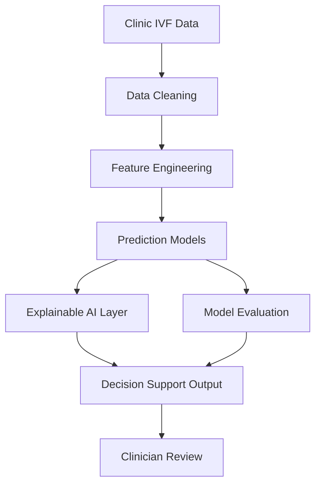

# Technical Blueprint

This page describes the likely technical plan for the actual research work.

It is not the final implementation plan. The final plan depends on clinic data access.

## Proposed System Idea

Build an explainable clinical decision support framework for IVF outcome prediction.

The system should:

1. accept patient, clinical, treatment-cycle and embryology data
2. predict IVF outcome probability
3. explain the prediction
4. show important positive and negative factors
5. support doctor-patient counseling
6. avoid replacing clinician judgment

## High-Level Architecture

## Data Pipeline

| Step | Purpose |
| --- | --- |
| Data collection | Collect anonymized IVF records from clinic/hospital. |
| Data cleaning | Handle missing values, inconsistent formats and outliers. |
| Data integration | Combine patient, clinical, treatment and embryology data. |
| Feature engineering | Create useful model variables from raw clinical data. |
| Model training | Train baseline and advanced ML models. |
| Model validation | Test model performance and generalizability. |
| Explainability | Use XAI methods to explain predictions. |
| CDSS output | Convert model results into doctor-friendly decision support. |

## Possible Technology Stack

| Area | Possible Tools |
| --- | --- |
| Data processing | Python, Pandas, NumPy |
| Machine learning | Scikit-learn, XGBoost, LightGBM |
| Explainable AI | SHAP, LIME, permutation importance |
| Visualization | Matplotlib, Seaborn, Plotly |
| Experiment tracking | MLflow or simple structured experiment logs |
| Web prototype | Streamlit, Flask or FastAPI |
| Database | CSV/Excel for prototype, PostgreSQL/MySQL for structured app |
| Documentation | MkDocs |

## Candidate Models

| Model | Role |
| --- | --- |
| Logistic Regression | Baseline model. Easy to explain. |
| Decision Tree | Simple interpretable model. |
| Random Forest | Strong non-linear baseline. |
| XGBoost | Strong tabular-data model. |
| LightGBM | Efficient gradient boosting model. |
| Support Vector Machine | Comparison model if dataset size is moderate. |
| Neural Network | Use only if data volume is large enough. |

## Recommended Model Strategy

Start simple:

1. Logistic Regression
2. Random Forest
3. XGBoost or LightGBM

Then compare performance and explainability.

Do not start with deep learning unless image/time-lapse or very large data are available.

## Possible Prediction Targets

| Target | Priority | Notes |
| --- | --- | --- |
| Clinical pregnancy | High | Usually easier to obtain than live birth. |
| Live birth | Very high | Strongest outcome if available. |
| Miscarriage | Medium | Useful for post-transfer risk. |
| Oocyte yield | Medium | Useful for ovarian stimulation response. |
| Good-quality embryo/blastocyst | Medium | Useful if embryology data available. |

## Data Model

The research data can be organized into these linked tables.

### Patient Table

| Field | Example |
| --- | --- |
| patient_id | anonymized ID |
| age | 32 |
| BMI | 24.5 |
| infertility_duration | 4 years |
| infertility_type | primary/secondary |
| diagnosis | PCOS, endometriosis, male factor etc. |

### Cycle Table

| Field | Example |
| --- | --- |
| cycle_id | anonymized cycle ID |
| patient_id | linked patient |
| cycle_year | 2023 |
| IVF_or_ICSI | ICSI |
| fresh_or_frozen | fresh |
| stimulation_protocol | antagonist |
| trigger_type | HCG |
| endometrial_thickness | 9.2 mm |

### Hormone Table

| Field | Example |
| --- | --- |
| cycle_id | linked cycle |
| AMH | 2.4 |
| AFC | 12 |
| FSH | 6.5 |
| LH | 4.2 |
| E2_trigger_day | 2100 |
| progesterone_trigger_day | 0.9 |

### Embryology Table

| Field | Example |
| --- | --- |
| cycle_id | linked cycle |
| oocytes_retrieved | 11 |
| mature_oocytes | 8 |
| fertilized_oocytes | 6 |
| embryo_grade | A/B/C |
| blastocyst_grade | 4AA |
| embryos_transferred | 1 |

### Outcome Table

| Field | Example |
| --- | --- |
| cycle_id | linked cycle |
| clinical_pregnancy | yes/no |
| live_birth | yes/no |
| miscarriage | yes/no |
| implantation_success | yes/no |

### Lifestyle Table

Use this only if collected.

| Field | Example |
| --- | --- |
| patient_id | linked patient |
| smoking | yes/no |
| sleep_quality | good/moderate/poor |
| stress_score | numeric scale |
| activity_level | low/moderate/high |
| diet_pattern | self-reported |

## Explainability Output

The final output should not only show a score.

Example output:

| Output | Example |
| --- | --- |
| Predicted probability | 58% chance of clinical pregnancy |
| Positive factors | age, AMH, embryo grade |
| Negative factors | high BMI, thin endometrium |
| Modifiable factors | BMI, smoking, stress |
| Non-modifiable factors | age, infertility duration |
| Doctor note | Use as counseling support, not final decision |

## Evaluation Plan

| Evaluation Area | Metrics |
| --- | --- |
| Classification performance | AUC, accuracy, sensitivity, specificity, precision, recall, F1 |
| Calibration | calibration curve, Brier score |
| Clinical usefulness | decision curve analysis if feasible |
| Generalization | external validation or subgroup validation |
| Explainability | SHAP summary, local explanation, clinician review |
| Usability | doctor feedback or structured questionnaire |

## Research Phases

| Phase | Work |
| --- | --- |
| Phase A | Data access and ethics approval |
| Phase B | Data cleaning and variable mapping |
| Phase C | Exploratory data analysis |
| Phase D | Baseline model development |
| Phase E | Advanced model development |
| Phase F | Explainable AI integration |
| Phase G | Validation and subgroup analysis |
| Phase H | Clinical decision support prototype |
| Phase I | Clinician review and refinement |
| Phase J | Thesis writing and publication |

## Expected Prototype

A simple prototype may include:

- data upload or sample patient entry
- predicted IVF outcome probability
- SHAP-based explanation
- positive and negative factors
- doctor-facing summary
- warning that output is decision support only

Possible prototype tools:

- Streamlit for quick research prototype
- FastAPI plus frontend if a more formal system is needed

## Important Caution

This research should not claim that AI will decide IVF treatment.

The correct framing is:

> AI-assisted decision support for doctors and patient counseling.
