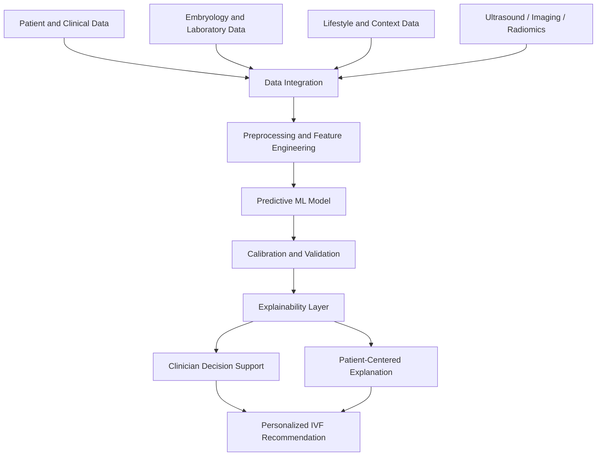

# Conceptual Framework

## Working Framework

## Input Data Groups

| Group | Examples |
| --- | --- |
| Demographic | age, BMI, infertility duration, prior cycles |
| Clinical | AMH, AFC, FSH, LH, progesterone, estradiol, PCOS/endometriosis status |
| Treatment cycle | stimulation protocol, gonadotropin dose, trigger timing, retrieved oocytes |
| Embryology | embryo grade, blastocyst quality, oocyte quality, sperm parameters |
| Imaging | embryo images, time-lapse videos, ultrasound/radiomics |
| Lifestyle | smoking, diet, physical activity, sleep, stress, occupation, environmental factors |

## Model Outputs

- predicted clinical pregnancy probability
- predicted live-birth probability
- predicted ovarian response
- key positive and negative drivers
- personalized treatment or counseling suggestion
- uncertainty and caution notes

## Evaluation Dimensions

- AUC, accuracy, sensitivity, specificity, precision, recall and F1
- calibration
- external validation
- subgroup/fairness analysis
- explanation quality
- clinician usability
- patient understandability
