# Research Workflow

The project follows this sequence:

```mermaid
flowchart LR
    A["Broad Area: Women's Healthcare and IVF"] --> B["Literature Search"]
    B --> C["Paper Extraction"]
    C --> D["Literature Matrix"]
    D --> E["Gap Frequency"]
    E --> F["Theme Classification"]
    F --> G["Research Problem"]
    G --> H["Research Questions"]
    H --> I["Objectives"]
    I --> J["Candidate Topics"]
    J --> K["Final Topic"]
```

## Current Stage

We are between:

- literature matrix building
- source cleaning
- theme classification
- repeated-gap shortlisting

The title is not final yet.

## Operating Principles

- Prefer 2021-2025 papers.
- Prefer Scopus, Web of Science, Elsevier, Springer, IEEE, Wiley and MDPI where relevant.
- Extract abstract, conclusion, discussion, limitations and future work first.
- Read full papers only for high-relevance papers.
- Mark unknown fields as pending instead of guessing.
- Keep Excel as the structured evidence base.
- Use this doc site as the research dashboard and thesis-planning workspace.
